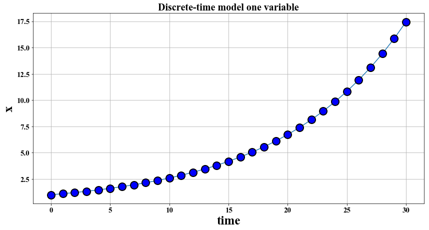
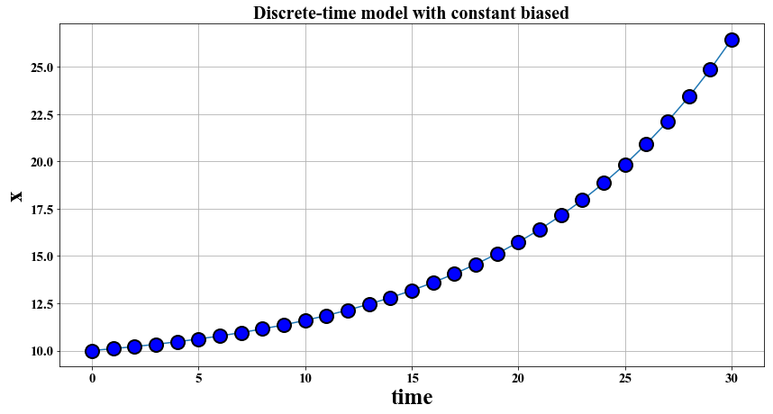
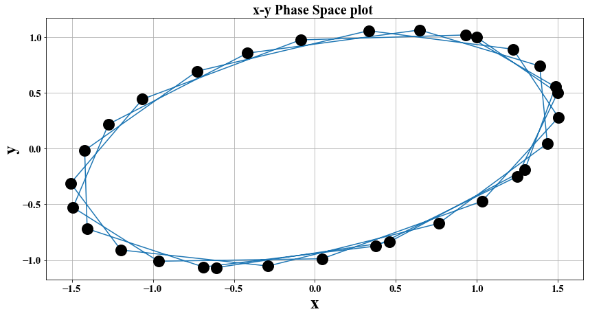
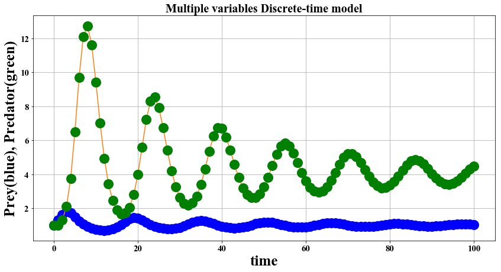

# Complexity Science 

### Discrete-Time Models Examples, Codes and Exercises


Main Reference: H. Sayama, Introduction to the Modeling and Analysis of Complex Systems

# PART 1.1 Discrete-time models with one variables

### Example 1. Consider the case of $x_t = a x_{t-1}$, let $a=1.1$ implying that $x$ increases by $10\%$ in each time step, simulate the evolution of $x$.


```python
#a = 1.1
a = 5.1

def initialize():
    global x, result
    x = 1.
    result = [x]

def observe():
    global x, result
    result.append(x)

def update():
    global x, result
    x = a * x

initialize()
for t in range(0,30):
    update()
    observe() 
```


```python
print (result)
```

    [1.0, 5.1, 26.009999999999998, 132.65099999999998, 676.5200999999998, 3450.252509999999, 17596.287800999995, 89741.06778509996, 457679.4457040098, 2334165.17309045, 11904242.382761294, 60711636.15208259, 309629344.3756212, 1579109656.315668, 8053459247.209907, 41072642160.77052, 209470475019.92966, 1068299422601.6412, 5448327055268.37, 27786467981868.688, 141710986707530.28, 722726032208404.4, 3685902764262862.0, 1.8798104097740596e+16, 9.587033089847704e+16, 4.889386875822329e+17, 2.493587306669388e+18, 1.2717295264013877e+19, 6.485820584647077e+19, 3.3077684981700094e+20, 1.6869619340667047e+21]


```python
import numpy as np
import matplotlib.pyplot as plt

%matplotlib inline
plt.rcParams["font.family"] = "Times New Roman"
```


```python
x1 = np.arange(0, 31, 1)

main_canvas = plt.figure(figsize = (14, 7))
plot_canvas = plt.subplot(1, 1, 1)

plot_canvas.plot(x1, result, marker = 'o', ms = 15, mew = 2, mfc = "blue", mec = "black")
plot_canvas.grid(True)
plot_canvas.set_title("Exponential growth discrete-time model", size = 20)
plot_canvas.set_xlabel(r"time", size = 25)
plot_canvas.set_ylabel(r"x", size = 25)
plot_canvas.tick_params(axis = "both", which = "both", labelsize = 15)
```


### Exercise 1. Consider various values of $a$ to see what types of behaviors are possible for this model and how $a$ determines the resulting behavior.


```python
a = 1.1
time_length=30

def initialize():
    global x, result
    x = 1
    result = [x]

def observe():
    global x, result
    result.append(x)

def update():
    global x, result
    x = a * x

initialize()
for t in range(0,time_length):
    update()
    observe() 
    
x1 = np.arange(0, time_length+1, 1)

main_canvas = plt.figure(figsize = (14, 7))
plot_canvas = plt.subplot(1, 1, 1)

plot_canvas.plot(x1, result, marker = 'o', ms = 15, mew = 2, mfc = "blue", mec = "black")
plot_canvas.grid(True)
plot_canvas.set_title("Discrete-time model one variable", size = 20)
plot_canvas.set_xlabel(r"time", size = 25)
plot_canvas.set_ylabel(r"x", size = 25)
plot_canvas.tick_params(axis = "both", which = "both", labelsize = 15)
```





### Exercise 2. Consider the following equation: $x_t = a x_{t-1} + b,  x_0=1$

Some real-world examples that can be modeled in this equation include fish population growth with constant removals due to fishing, growth of credit card balances with constant monthly payments (both with negative b) or repayment of loans. Change the values of a and b, and see if the system’s behaviors are the same as those of the simple exponential growth/decay model.

For fish population growth: 

Excerpts from Murray chapter 2.6 (http://matriisi.ee.tut.fi/courses/MAT-35006/pIIexam/Murray_Ch2.pdf): Discrete models have been used in fishery management for some considerable time.
They have often proven to be useful in evaluating various harvesting strategies with a view to optimising the economic yield and to maintaining it. Just a few of the relevant books on management strategies are those by Clark (1976b, 1985, 1990), Goh (1982), Getz and Haight (1989), Hilborn and Mangel (1997), the series of papers edited by Cohen (1987) and appropriate sections in the collection of articles edited by Levin (1994). The following model is applicable, in principle, to any renewable resource which is harvested; the detailed analysis applies to any population whose dynamics can be described by a discrete model.

Let $b$ be the harvest taken from the population at time t, which generates the next population at t + 1. In general, the equation should be: $x_t = a F(x_{t-1}) + b$ The questions we can address here are: (i) What is the maximum sustained biological yield? (ii) What is the maximum economic yield? These questions can be answered more precisely in the suceeding topics.


```python
a = 1.1
b = -.9
time_length=30

def initialize():
    global x, result
    x = 10
    result = [x]

def observe():
    global x, result
    result.append(x)

def update():
    global x, result
    x = (a * x) + b

initialize()
for t in range(0,time_length):
    update()
    observe() 
    
x1 = np.arange(0, time_length+1, 1)

main_canvas = plt.figure(figsize = (14, 7))
plot_canvas = plt.subplot(1, 1, 1)

plot_canvas.plot(x1, result, marker = 'o', ms = 15, mew = 2, mfc = "blue", mec = "black")
plot_canvas.grid(True)
plot_canvas.set_title("Discrete-time model with constant biased", size = 20)
plot_canvas.set_xlabel(r"time", size = 25)
plot_canvas.set_ylabel(r"x", size = 25)
plot_canvas.tick_params(axis = "both", which = "both", labelsize = 15)
```





### Exercise 3. Loan model.
An MSDS student borrowed 1 M pesos with 8 percent per annum interest (interest applied only to the remaining balance). Model how fast can the student pay up the loan with 30k, 50k, 75k monthly payment.


```python
a = 1 + (.08/12) 
#Monthly interest
b = -.05 
#50k per month
time_length=60
#Number of Months


def initialize():
    global x, result
    x = 1.5
    result = [x]

def observe():
    global x, result
    result.append(x)

def update():
    global x, result
    x = (a * x) + b

initialize()
for t in range(0,time_length):
    update()
    observe() 
    
x1 = np.arange(0, time_length+1, 1)

main_canvas = plt.figure(figsize = (14, 7))
plot_canvas = plt.subplot(1, 1, 1)

plot_canvas.plot(x1, result, marker = 'o', ms = 15, mew = 2, mfc = "blue", mec = "black")
plot_canvas.grid(True)
plot_canvas.set_title("Loans Discrete-time model", size = 20)
plot_canvas.set_xlabel(r"time", size = 25)
plot_canvas.set_ylabel(r"x", size = 25)
plot_canvas.tick_params(axis = "both", which = "both", labelsize = 15)
```


# PART 1.2 Discrete-time models with Multiple variables: Linear

Now we are making a first step to complex systems simulation. Let’s increase the number of variables from one to two. Consider the following difference equations:

$x_t = 0.5x_{t-1} + y_{t-1}$ 
   
$y_t = -0.5x_{t-1} + y_{t-1}$   
   
with initial conditions $x_0 = 1$ and $y_0 = 1$   


```python

time_length=30

def initialize():
    global x, y, xresult, yresult
    x = 1.
    y = 1.
    xresult = [x]
    yresult = [y]

def observe():
    global x, y, xresult, yresult
    xresult.append(x)
    yresult.append(y)

def update():
    global x, y, xresult, yresult
    nextx = 0.5 * x + y
    nexty = -0.5 * x + y
    x,y=nextx, nexty

initialize()
for t in range(0,time_length):
    update()
    observe()
    
x1 = np.arange(0, time_length+1, 1)

main_canvas = plt.figure(figsize = (14, 7))
plot_canvas = plt.subplot(1, 1, 1)

plot_canvas.plot(x1, xresult, marker = 'o', ms = 15, mew = 2, mfc = "blue", mec = "blue")
plot_canvas.plot(x1, yresult, marker = 'o', ms = 15, mew = 2, mfc = "green", mec = "green")
plot_canvas.grid(True)
plot_canvas.set_title("Multiple variables Discrete-time model", size = 20)
plot_canvas.set_xlabel(r"time", size = 25)
plot_canvas.set_ylabel(r"x", size = 25)
plot_canvas.tick_params(axis = "both", which = "both", labelsize = 15)    

```


### Plotting in x-y phase space,  one way of looking at the periodicity of the trajectory of the system.


```python
main_canvas = plt.figure(figsize = (14, 7))
plot_canvas = plt.subplot(1, 1, 1)

plot_canvas.plot(xresult, yresult, marker = 'o', ms = 15, mew = 2, mfc = "black", mec = "black")
#plot_canvas.plot(x1, yresult, marker = 'o', ms = 15, mew = 2, mfc = "green", mec = "green")
plot_canvas.grid(True)
plot_canvas.set_title("x-y Phase Space plot ", size = 20)
plot_canvas.set_xlabel(r"x", size = 25)
plot_canvas.set_ylabel(r"y", size = 25)
plot_canvas.tick_params(axis = "both", which = "both", labelsize = 15)  
```





If you play with this simulation model for various coefficient values, you will soon notice
that there are only certain kinds of behaviors possible in this system. Sometimes
the curves show exponential growth or decay, or sometimes they show more smooth oscillatory
behaviors. These two behaviors are often combined to show an exponentially
growing oscillation, etc. But that’s about it. You don’t see any more complex behaviors
coming out of this model. This is because the system is linear, i.e., the model equation
is composed of a simple linear sum of first-order terms of state variables. So here is an
important fact you should keep in mind:

Linear dynamical systems can show only exponential growth/decay, periodic oscillation,
stationary states (no change), or their hybrids (e.g., exponentially growing oscillation).

# PART 1.3 Discrete-time models with Multiple variables: Nonlinear

### Exercise 4: Implement the Lotka-Volterra Equation!

Arguably the most famous mathematical model of nonlinear dynamical systems, the Lotka-Volterra equation models the number of prey $x$ and predators $y$ as:

\begin{equation}
x_t=x_{t-1} + r_x (1 - \frac{x_{t-1}}{\kappa}) x_{t-1} - (1 - \frac{1}{b y_{t-1} +1})x_{t-1}
\end{equation}

\begin{equation}
y_t=y_{t-1} - d_y y_{t-1} + c x_{t-1} y_{t-1}
\end{equation}

where: 
   
$\kappa$- prey's carrying capacity,   
$r_x$ - growth rate of prey,    
$r_y = c x_{t-1}$ - growth rate of predators because of prey,    
$d_y$ - death rate of predators,     
$d_x = 1 - \frac{1}{b y_{t-1} +1}$ - death rate of prey due to predators.

### Consider the case when $r_x=b=d_y=c=1$, $\kappa=5$, $x_0 =y_0=1$:
  
### a) plot $x, y$ vs time    
   
### b) plot $x$ vs $y$

### Duplicate the results below


```python
 

```





```python

```


